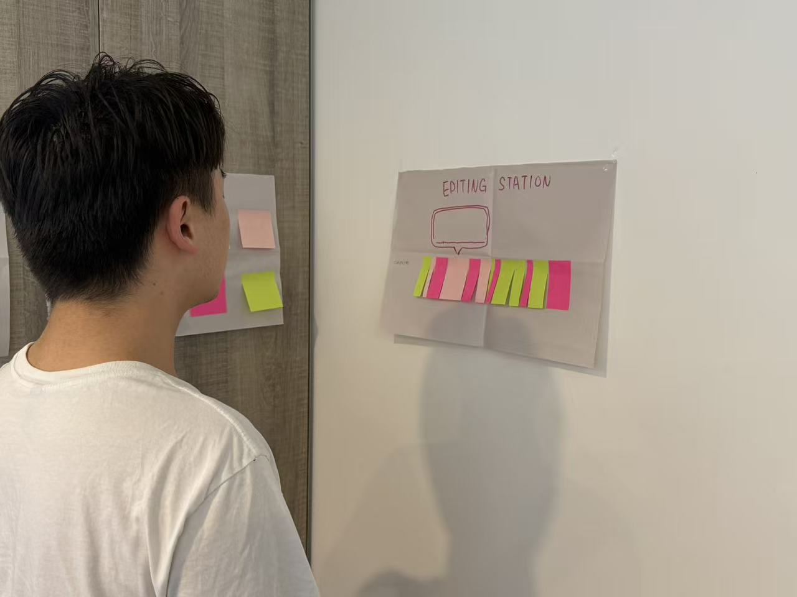
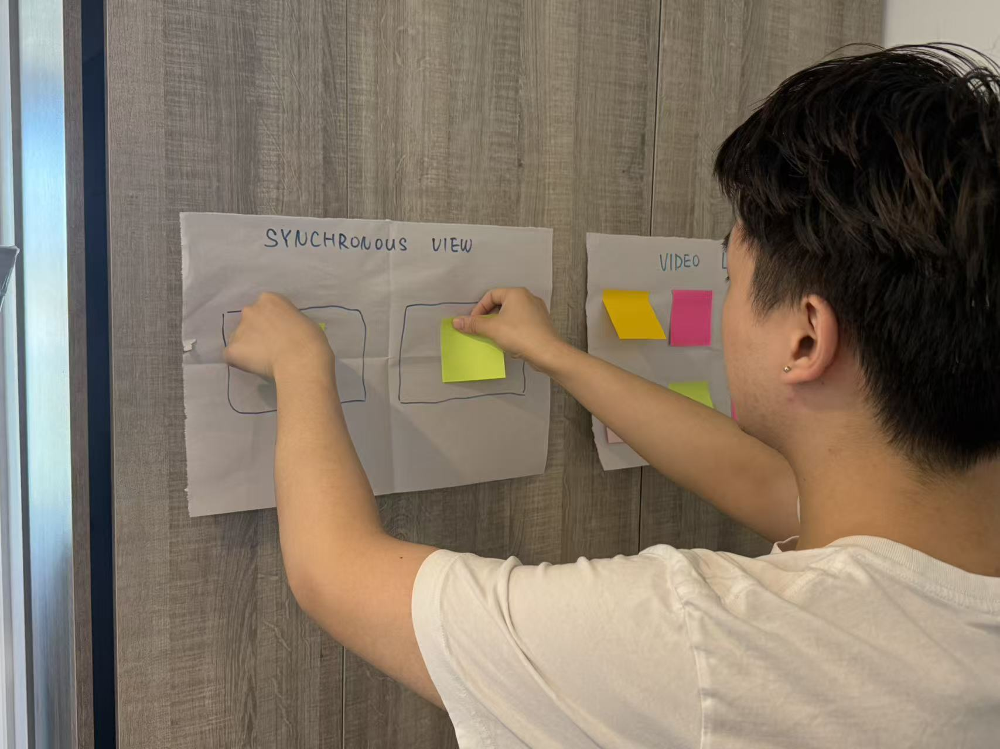
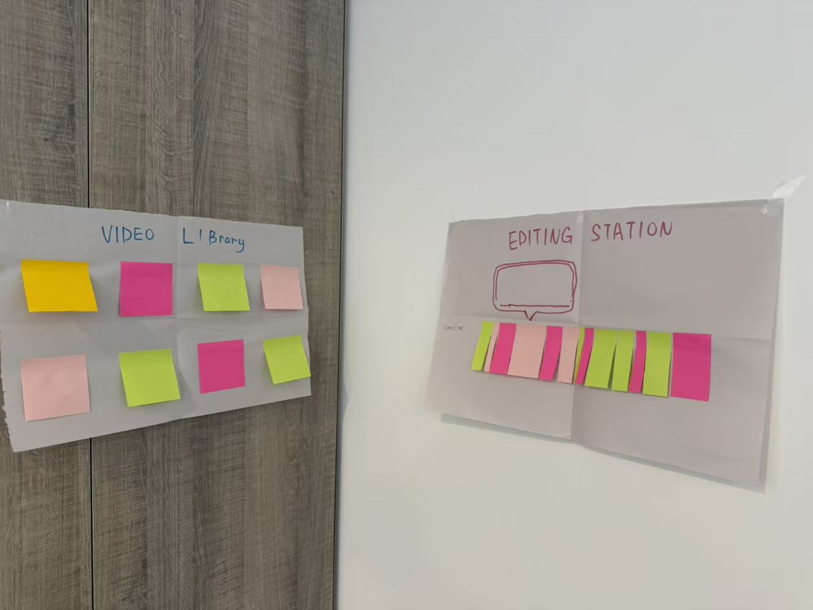
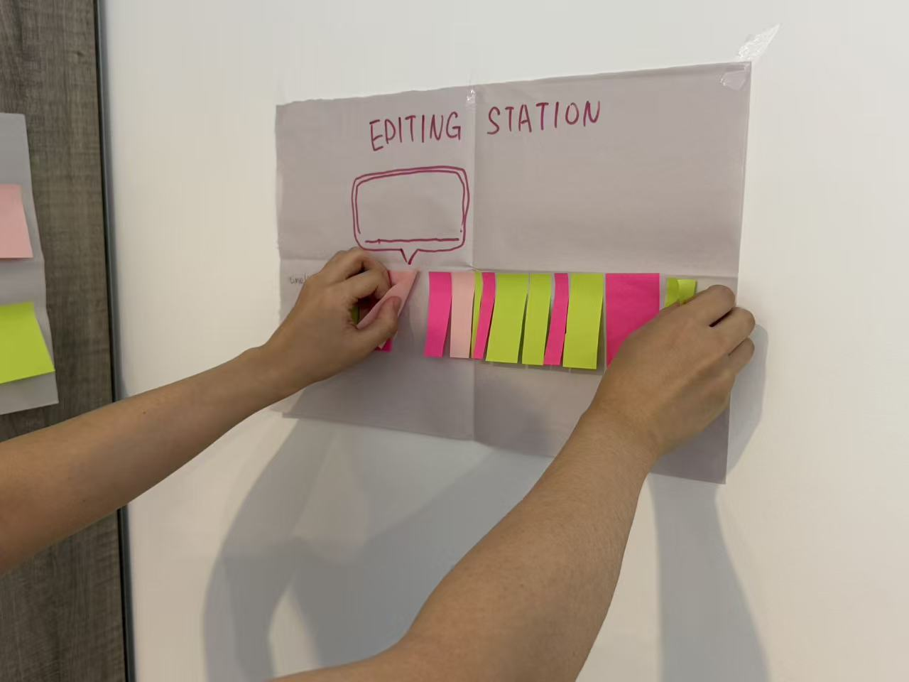
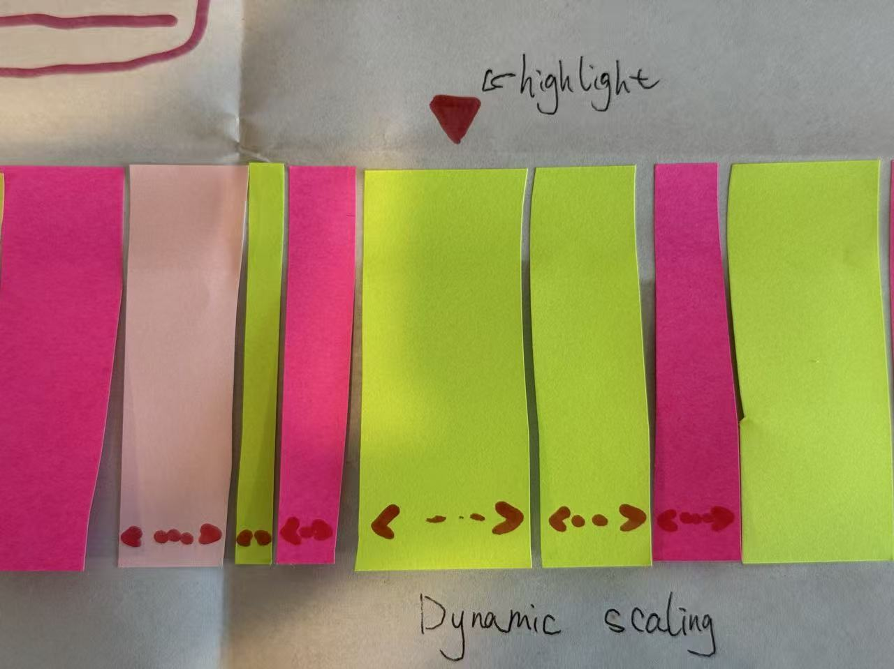

# Spatial Editing Wall Concept Report

## Introduction
**Application Name:** Spatial Editing Wall  
**Category:** Editing  

Spatial Editing Station is a video editing tool based on mixed reality (MR) technology. It maps video footage and a timeline onto a virtual wall in the user's space, allowing users to interact directly with the virtual interface within their real environment. Compared to traditional 2D timeline editing interfaces, the application's spatial layout and immersive gesture interaction make the video editing process more intuitive and efficient, and also supports multitasking and immersive footage management.

---

## User Tasks and Goals

### 1. Sorting Videos
- **Operation:** Users grab video clips from the virtual wall and drag them to change their order. The timeline updates instantly.  
- **Success Criteria:** Accurate order adjustment, with real-time feedback from the system without lag.

### 2. Precise Cutting
- **Operation:** Users pinch-zoom on a floating clip and tap the "cut point" to complete the split.  
- **Success Criteria:** Cuts are frame-accurate, with the new clip automatically fitting into the timeline.

### 3. Multi-Clip Comparison
- **Operation:** Users place two clips in different playback areas and play them side by side to compare color, composition, or rhythm.  
- **Success Criteria:** Synchronous playback, smooth switching, and the ability to instantly replace or retain clips.

---

## XR Concept and Immersive Interaction

### Immersion
A wraparound virtual wall displays all footage, immersing the user in the footage and minimizing external distractions.

### 1. Physical Affordances
- Grab a video clip: Approach → Highlight → Grab with gestures.  
- Zoom Timeline: Pinch to zoom in/out on the clip preview.

### 2. Spatial Layout
Divide the wall into different areas, organized by duration, theme, and project, with different footage categories.

### 3. Haptics
When a cut is successful, the controller will vibrate slightly as confirmation.

### 4. Spatial Audio
Boost the volume of a clip only when you're near the playback area, preventing interference from the mix.

---

## Creative Process and Iteration

The idea for this project stemmed from a reflection on traditional video editing interfaces. While conventional video editing software offers rich functionality, its interface layout is often limited to flat screens. Material management and timeline editing require frequent switching between views, reducing operational efficiency.

Based on this, I aimed to leverage the spatial advantages of mixed reality (MR) to visualize and immerse key aspects of video editing, allowing users to quickly sort materials, precisely cut clips, and iterate within an immersive environment.

In the initial conceptualization phase, I used sticky notes, whiteboard cards, and a desktop layout to simulate a "spatial editing wall." Each video clip was represented by a colored card, which could be moved around on the whiteboard to simulate sorting, and the time scale on the card could be used to simulate cutting. Two students participated in preliminary testing, and while they performed well in sorting, they reported that they were prone to misjudging the precise cuts due to unclear scale markings.

  
  
  
  
  

### Improvements During Iteration
1. **Optimizing sorting visibility:** Adding highlighted borders and color grouping to clip cards makes it easier for users to locate and distinguish different types of clips in space.  
2. **Improving editing precision:** A new dynamic zoom feature in the timeline allows users to zoom in to the frame level and edit using gestures, addressing the issue of limited precision.  

This iteration not only refined the functional prototype but also validated the potential of mixed reality (MR) environments to improve video editing efficiency and usability. These improvements will be further verified and fine-tuned in subsequent mid-term prototype testing to ensure that users can smoothly complete tasks in an immersive environment.

---

## Initial Testing Plan

### Test Objectives
- Verify that users can quickly understand grabbing, sorting, and cutting operations.  
- Examine whether spatial layout improves resource search efficiency.  

### Hypothesis
- Gesture grabbing is more intuitive and faster to sort than menu selection.  
- Spatial partitioning reduces resource search time.  

### Data Collection Methods
- Task Completion Time (seconds)  
- Number of Operation Errors  
- Users' Subjective Usability Rating (1–5)  
- Observed Pauses, Hesitations, and Confusion Points  
