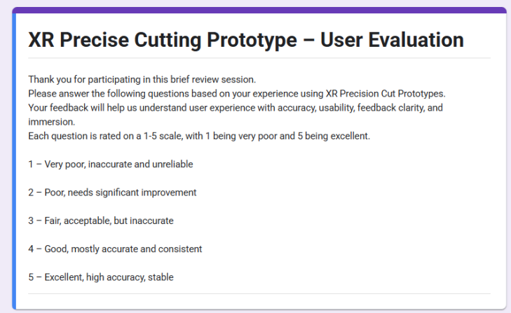
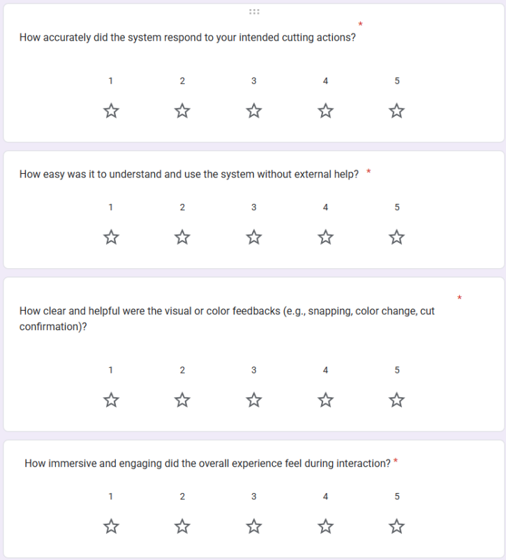
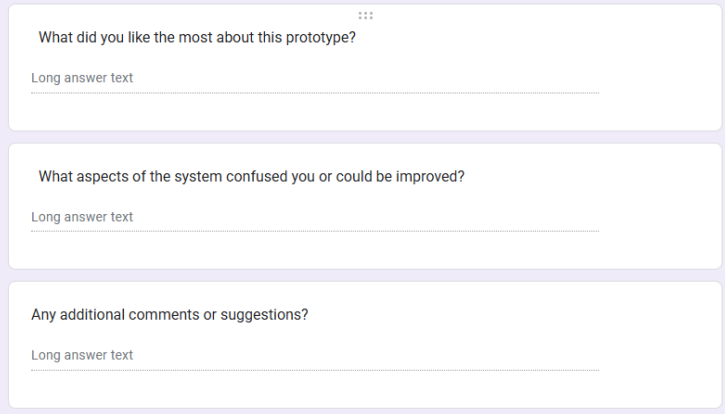

# Design Process Report – Evaluation

**Author:** Peilin Li  
**Student ID:** s4797896  

---

## Objective and Validation Metrics

The primary objectives of this prototype test were to verify whether the new **“Precision Editing”** feature effectively supports user operational needs in an immersive environment and to evaluate its improved value compared to traditional 2D interfaces.

The specific objectives were as follows:

1. **Understandability and Learning Curve**  
   This test aimed to confirm whether users could understand and master operations such as the timeline slider, ruler, snap, cut, and undo **without explicit instruction**.  
   - This objective was considered achieved if:
     - The majority of users were able to complete a valid cut within a short period of time, and  
     - They could correctly use the snap or undo functions.

2. **Accuracy and Efficiency**  
   The test focused on assessing user performance when performing goal-oriented editing tasks (e.g., cutting between `00:05.0` and `00:12.0`).  
   - This objective was considered achieved if:
     - Participants could complete **two cuts** (total duration no more than **90 seconds**) within the expected timeframe,  
     - With an average error of no more than **±0.3 seconds**, and  
     - With a **low number of undos and miscuts**.

3. **Subjective Experience**  
   A questionnaire was used to collect participants’ subjective evaluations of:
   - Accuracy  
   - Ease of use  
   - Feedback clarity  
   - Immersion  

   If the average score was **higher than 3.5/5** and at least **two indicators were higher than 4.0**, it would indicate that the design had good intuitiveness and usability in the interactive experience.

---

## Results

During testing, five participants completed two editing tasks:

- **Task A:** Exploratory  
- **Task B:** Goal-oriented  

Overall operation was smooth, but there were differences in understanding speed and accuracy among users.

- Most users were able to understand the system logic and complete the cutting operation quickly.  
  - **Four** participants completed their first valid cut within **30 seconds**,  
  - **Three** of them actively used the **snap** or **undo** functions.

For the **goal-oriented task (Task B)**:

- The **average total time** was approximately **76 seconds**.  
- Most cutting errors were within **±0.3 seconds**.  
- **Three** participants successfully completed all cuts in **one try**,  
- Some users experienced **minor delays or cutting errors**.

**Questionnaire feedback:**

- Overall average score: **4.1/5**  
- Highest scoring dimension: **Feedback Clarity**  
- Some users noted:
  - The scale density was slightly high  
  - Initial understanding took some time  

Overall, the testing process was smooth, system functionality was stable, and there were **no serious errors or interruptions** during operation.

---

## Analysis / Insights

The test results revealed several distinct usage patterns and behavioral characteristics:

1. **Snapping Mechanism and Color Feedback**  
   - The snapping mechanism and color feedback were **frequently used** and mentioned by most users.  
   - The design effectively **reduced user anxiety and uncertainty** during precise cutting.  
   - Users generally felt that:
     - Snapping made it easier to determine the cut point.  
     - Visual color changes helped confirm successful operation.  
   - This indicates that **immediate feedback** played a key role in **building operational confidence**.

2. **Differences in Learning Requirements**  
   - Users familiar with digital interfaces quickly grasped the system’s logic.  
   - Some first-time users showed brief hesitation during **Task A**, especially confused by the **fine-grained scale**.  
   - This reveals that:
     - Interface comprehensibility still depends on the user’s **digital experience level**.  
     - The system still has room for improvement in **initial onboarding**.

3. **Role of Undo in Error Tolerance**  
   - The data demonstrates the importance of the **undo** function in:
     - Controlling frustration, and  
     - Maintaining smooth operation.  
   - Participants immediately attempted to **undo and redo** after making an incorrect cut.  
   - The process was smooth and minimally interrupted, demonstrating a **robust error-tolerance mechanism**.

---

## Evaluation of Aims

Overall, the main objectives of this test were **largely achieved**.

1. **Understandability and Learning Curve**  
   - Most participants completed their first cut **without instruction**.  
   - Four users completed the task within **30 seconds**.  
   - This shows that overall system operation is **relatively intuitive**.  
   - However:
     - Some users struggled with understanding the functions of the **scale** and **cut button**,  
     - Suggesting that **interface guidance needs improvement**.

2. **Accuracy and Efficiency**  
   - All participants completed the goal-oriented task with:
     - An average total time of approximately **76 seconds**, and  
     - Cutting errors generally within **±0.3 seconds**.  
   - Three users successfully completed two cuts in **one attempt**.  
   - This demonstrates that the **snap** and **scale** features significantly improved **accuracy**.  
   - However:
     - Some users still experienced miscuts in areas with **dense scales**,  
     - Indicating room for improvement in **visual cues** and **snap sensitivity**.

3. **Subjective Experience**  
   - Questionnaire results showed:
     - Overall average score: **4.1/5**  
     - **“Feedback Clarity”** received the highest rating.  
   - This indicates that **visual feedback and color changes** effectively enhanced **user confidence and immersion**.  
   - However, some users requested:
     - More obvious **initial guidance**, and  
     - A **simpler scale display**.

**Summary:**  
This test verified the feasibility of the **“Precision Editing”** prototype in terms of **accuracy and feedback**. The core interaction goals were basically achieved; however, there is still room for improvement in:

- Lowering the **learning threshold**, and  
- Improving the **first-time user experience**.

---

## Concept Iteration

Based on the test results:

- Users were generally able to successfully complete **precise editing tasks**,  
- But there is still room for improvement in:
  - **Operational feedback**,  
  - **Scale readability**, and  
  - **Slider stability**.

Therefore, the next concept iteration will focus on:

> **Optimizing the user experience of existing features, improving interaction clarity and operational smoothness without increasing system complexity.**

### 1. Snapping and Scale Display

- Users generally agreed that the **snapping mechanism** improved operational accuracy.  
- However, some participants reported:
  - Difficulty distinguishing between **primary and secondary scales** in areas with dense timeline markers.  
  - Snap trigger feedback was **not clear enough**.

**Planned improvements:**

- **Differentiate scale levels visually:**
  - Keep the existing scale layout, but:
    - Make **primary scale lines** clearer (stronger contrast),  
    - Make **secondary scale lines** fainter (lower opacity).  
  - This helps users more easily identify their position.

- **Enhance snap feedback:**
  - When the pointer enters the snapping range:
    - The scale dot will briefly **illuminate** with a slight color change,  
    - Providing a visual **“snap confirmation”** signal.  

These adjustments aim to:

- Enhance user awareness of the snapping mechanism, and  
- Reduce **accidental cuts** or **repeated operations**.

### 2. Operation Feedback and Status Confirmation

Although color changes already provide feedback, some users are still unsure whether the **cut** or **undo** operation was successful.

**Planned improvements:**

- After a successful cut:
  - Add a brief **highlight flashing effect**, and  
  - Show a concise text prompt, e.g. `Cut @ 00:12.3`.  

- After an undo operation:
  - Add a slight **transition color change**,  
  - Making the feedback more **continuous and natural**.

---

## Reflection on the Concept, Design, Methodologies, and Future Testing

This prototype testing gave me a deeper understanding of:

- The **design process**,  
- **Testing methods**, and  
- **User feedback**,  

and also allowed me to clearly see the concept’s **potential and limitations** in practical application.

### Design Reflection

- The **spatialized timeline** and **snapping mechanism**:
  - Effectively enhanced **immersion** and **operational confidence**.  
- However, during **high-precision tasks**:
  - Positioning inaccuracy and difficulty identifying scales still appeared.  

This suggests future designs need to **better balance**:

- **Immersion**, and  
- **Precise control**.

### Methodological Reflection

- The combination of **exploratory** and **goal-oriented** tasks:
  - Helped collect both **qualitative** and **quantitative** data.  
- However:
  - The **sample size** was small, and  
  - The data remained **subjective**.  

**Future improvements:**

- Incorporate more **structured quantitative metrics**, such as:
  - Margin of error  
  - Completion time  
- Invite users with **editing experience** to participate,  
- Improve the **reliability** and **generalizability** of the results.

### Personal Reflection

- The design experience shows that **feedback mechanisms**:
  - Have a greater impact on user experience than simply adding more features.  
- Color changes and undo actions:
  - Increased user confidence.  
- However:
  - Snapping feedback and slider smoothness still need optimization to improve:
    - **Controllability**, and  
    - **Intuitiveness**.

This process taught me to:

- Advance design through **small, focused improvements** under limited conditions, and  
- Continuously adjust direction based on **user feedback**.

In future testing, I plan to:

- Continue this **iterative rhythm**,  
- Focus on key issues in each iteration, and  
- Gradually grow the design into a more **stable**, **trustworthy**, and **understandable** interactive experience.

---

## Appendices

### Test Records

In this test, five participants completed the tasks. Their records are as follows:

---

#### Participant 1

- **Task A (Exploratory):**
  - Without instruction, P1 first attempted playback and slider manipulation.  
  - Understood the cut function after approximately **20 seconds**.  
  - First successful cut: **28 seconds**.  
  - **Undo:** used once  
  - **Snap:** used once  
  - No verbal assistance was sought.

- **Task B (Goal-oriented):**
  - Completed **two cuts** in **75 seconds**.  
  - Errors:
    - First cut: **+0.18 s**  
    - Second cut: **-0.25 s**  
  - Both attempts were successful on the **first try**.  
  - **Undo:** used once  
  - **Miscuts:** none

- **Average questionnaire score:** **4.2/5**  
  - Accuracy: 4  
  - Ease of Use: 4  
  - Clarity of Feedback: 5  
  - Immersion: 4  

- **Note:**  
  - Users reported that the **color feedback** was helpful,  
  - But the **scale** was a bit **dense**.

---

#### Participant 2

- **Task A:**
  - Appeared hesitant upon initial entry.  
  - Attempted to play and manipulate the sliders, then asked if they could “grab” the video.  
  - First success: **45 seconds**, without using the **snap** feature.  
  - **Undo:** attempted **twice**.

- **Task B:**
  - Total time: **95 seconds**.  
  - Errors:
    - First cut: **+0.4 s** (late)  
    - Second cut: **-0.2 s**  
  - Required **two attempts** for the first cut.  
  - **Undo:** attempted **three times**.  
  - **Miscuts:** one incorrect cut.

- **Average questionnaire score:** **3.4/5**  
  - Accuracy: 3  
  - Usability: 3  
  - Clarity of Feedback: 4  
  - Immersion: 3  

- **Note:**  
  - Slow to understand the scale.  
  - Recommended adding initial prompts or more intuitive labeling.

---

#### Participant 3

- **Task A:**
  - Learned quickly.  
  - First success: **18 seconds**.  
  - **Snap:** used twice.  
  - **Undo:** not used.  
  - No verbal instruction.

- **Task B:**
  - Two cuts took a total of **60 seconds**.  
  - Errors:
    - First cut: **+0.1 s**  
    - Second cut: **+0.05 s**  
  - Both cuts were successful on the **first try**, with no mistakes.

- **Average questionnaire score:** **4.8/5**  
  - Accuracy: 5  
  - Ease of Use: 5  
  - Clear Feedback: 5  
  - Immersion: 4  

- **Notes:**  
  - Operation was smooth.  
  - Snapping felt natural.  
  - Fast-forward and rewind functions were useful.

---

#### Participant 4

- **Task A:**
  - Spent time understanding the **“Cut”** button.  
  - First success: **38 seconds**.  
  - **Undo:** once  
  - **Snap:** not used.

- **Task B:**
  - Completed two cuts in **82 seconds**.  
  - Errors:
    - First attempt: **-0.35 s**  
    - Second attempt: **+0.22 s**  
  - **Undo:** twice.

- **Average questionnaire score:** **3.9/5**  
  - Accuracy: 4  
  - Usability: 3  
  - Feedback Clarity: 4  
  - Immersion: 4  

- **Note:**  
  - Hoped the slider could move more smoothly.  
  - Wanted the **snap feature** to be more obvious.

---

#### Participant 5

- **Task A:**
  - Quickly understood the interface logic.  
  - First success: **22 seconds**.  
  - **Snap:** used once  
  - **Undo:** 0 times.

- **Task B:**
  - Completed two cuts in **68 seconds**.  
  - Errors:
    - First cut: **+0.12 s**  
    - Second cut: **-0.18 s**  
  - Both cuts were successful on the **first try**, with no errors.

- **Average questionnaire score:** **4.5/5**  
  - Accuracy: 5  
  - Usability: 4  
  - Clarity of Feedback: 4  
  - Immersion: 5  

- **Note:**  
  - Overall experience was smooth.  
  - Particularly enjoyed the combination of **color feedback** and **snapping**.

---

## Questionnaire

> 
> 
> 
---

## Statement of Originality

I confirm that the Unity prototype design submitted here is my **original work**.

During development:

- I used **AI tools** to assist in coding some interactive features.  
- I used **Google Translate** for translation and grammar checking.  

Except as noted above:

- All Unity implementation and textual content are **my own**.

---
