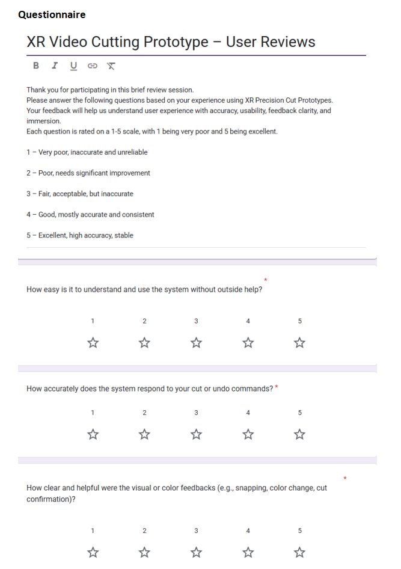
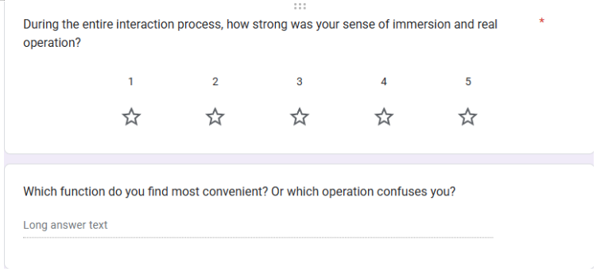
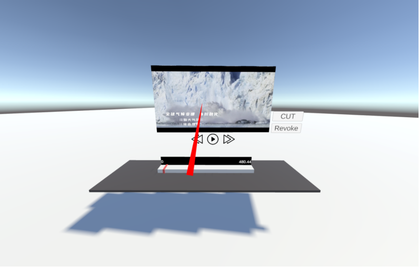

# Final Report and Reflection
*Peilin Li — s4797896*

---

## Objective and Validation Metrics

The primary objective of this test is to verify whether the **Spatialized Video Editing System** can enable users to understand and complete basic video editing operations in a more natural and intuitive way within an immersive XR environment.

The test focuses on the following three core dimensions:

### 1. Understandability
The test evaluates whether users can quickly understand and correctly use the core functions (play, fast forward/rewind, cut, undo, mark) without additional guidance.

**Success criteria:**
- Participants complete their first effective operation within **1 minute**
- Participants correctly identify main buttons and interaction logic

### 2. Accuracy & Efficiency
The test examines controllability and precision via task-oriented editing operations.

**Success criteria:**
- Participants complete the task within **90 seconds**
- Error range within **±0.5 seconds**
- Low amount of undo operations

### 3. User Experience
Participants completed a post-test questionnaire.

**Success criteria:**
- Average score **> 4.0 / 5**
- Indicates high intuitiveness and immersion

---

## Results

Five participants completed two tasks each.

### Free Exploration
- Most participants understood the interface within **30 seconds**
- All were able to complete a first cut independently  
- Some hesitation appeared for **Undo** and **Mark**, but all users succeeded eventually

### Goal-Oriented Task
- Average completion time: **78 seconds**
- Error range: **±0.5 seconds**
- Most users completed two cuts accurately
- Minor delays appeared when correcting cuts using **Undo**

### Questionnaire
- Overall average score: **4.16 / 5**
- Highest:  
  - *Usability* > 4.2  
  - *Reaction accuracy* > 4.2  
- Slightly lower scores (~4.0):  
  - *Visual feedback clarity*  
  - *Immersion*  

Most participants expressed that the **Cut** function was most convenient, while **Undo/Merge** caused occasional confusion.

---

## Analysis / Insights

### (1) Instant visual feedback significantly improved trust
All participants relied on color feedback for:
- marking points  
- confirming undo  
- verifying cut accuracy  

Color responses increased:
- operational confidence  
- predictability  
- stability during repeated tasks

Compared to earlier prototypes, this version produced **more consistent and reliable feedback**.

---

### (2) Learning speed depends on prior digital experience  
- Experienced users (P3, P5): ~20 seconds to complete first cut  
- Less experienced users (P2, P4): ~40 seconds, with repeated hesitations  

This reveals:
- XR spatial layout *helps* comprehension  
- But initial guidance is **still necessary**  
- System intuitiveness depends partially on prior exposure to digital interfaces  

---

### (3) Immersion increases engagement, but excessive focus reduces controllability  
Some users reported:
- mild fatigue  
- tension when staring at the virtual screen  
- difficulty maintaining precision under high immersion  

Result:
- Immersion is **not universally beneficial**  
- Cognitive load must be balanced with operational clarity  

---

### Summary of Insights
User confidence comes from:
- clear feedback  
- strong error tolerance  

System comprehensibility depends on:
- quality of initial guidance  
- rhythm of feedback and interaction  

The spatial editing concept improves:
- intuitiveness  
- posture-natural interactions  

But requires balance between:
- immersion  
- operational precision  

---

## Evaluation of Aims

### (1) Comprehensibility – **Achieved**
- Most participants completed first cut within 1 minute  
- High layout intuitiveness  
- Minor hesitation with Undo/Mark → guidance still needed  

### (2) Accuracy & Efficiency – **Achieved**
- All participants completed two cuts within 90 seconds  
- Error range acceptable  
- Undo usage low → stable control  
- Zoom and color feedback improved precision  

### (3) Subjective Experience – **Generally Achieved**
- Avg score: **4.16 / 5**  
- Ease of use & responsiveness highest  
- Immersion slightly lower due to visual fatigue  

Overall:
- Good stability  
- Good usability  
- Need improvement in guidance clarity and long-term comfort

---

## Appendices

### Test Records

#### **Participant 1**
- **Task A:**  
  - Learned in ~25s  
  - 1 undo, 1 mark  
- **Task B:**  
  - 78s total  
  - Errors: +0.25s / –0.30s  
- **Questionnaire Avg:** 4.0  
- **Notes:** Undo feedback could be clearer

---

#### **Participant 2**
- **Task A:**  
  - First cut ~30s  
  - 2 undo attempts  
- **Task B:**  
  - 85s total  
  - Errors: +0.4s / –0.2s  
- **Questionnaire Avg:** 4.2  
- **Notes:** Color feedback good; needs more guidance

---

#### **Participant 3**
- **Task A:**  
  - Learned in ~22s  
  - Used mark + undo  
- **Task B:**  
  - 68s total  
  - Errors: +0.2s / –0.1s  
- **Questionnaire Avg:** 4.5  
- **Notes:** Smooth operation; strong praise for visual feedback

---

#### **Participant 4**
- **Task A:**  
  - ~35s learning  
  - 2 undos  
- **Task B:**  
  - 90s total  
  - Errors: +0.5s / –0.4s  
- **Questionnaire Avg:** 3.8  
- **Notes:** Slow to understand marker; interface density slightly high

---

#### **Participant 5**
- **Task A:**  
  - ~28s  
  - 1 undo, 1 mark  
- **Task B:**  
  - 72s total  
  - Errors: +0.3s / –0.2s  
- **Questionnaire Avg:** 4.3  
- **Notes:** Smooth experience; FF/rewind useful

---

## Questionnaire
> 
> 

---

## Prototype Screenshots
> 
